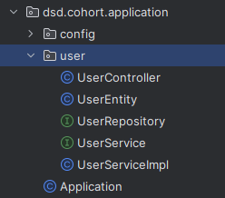
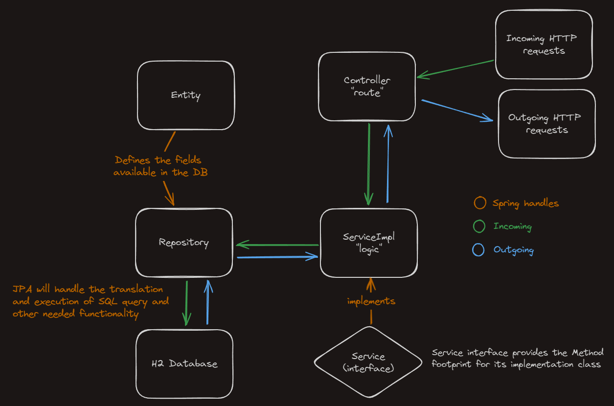
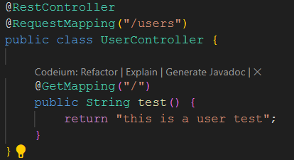
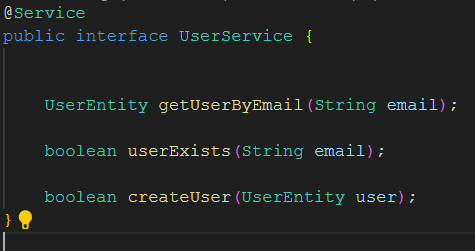
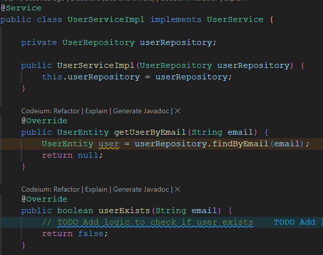
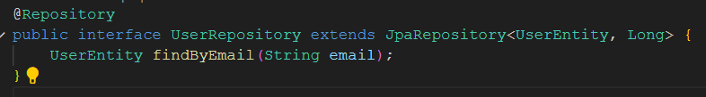
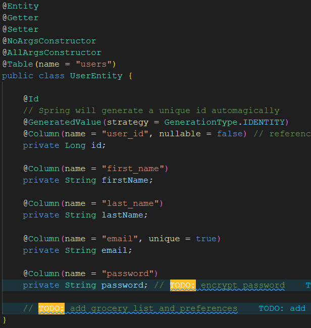

### Understanding Spring Data Flow and what the different files are used for
---

With our project being "small", the project file structure will look like the above User folder.
Each folder contains a the files concerning an Entity. ie: User, Recipe, etc.

### Spring Data Flow
---

---
### Controllers

  - Our controller files will be responsible for handling HTTP requests.
    The normal CRUD methods will be used here. GET, POST, PUT, DELETE

---
### Services

- Our service interface files will define the methods that will be used by the service.
  
---
### ServiceImpls

- Our service implementation files will define the methods that will interact with the database via the repository.
---
### Repositories

- Our repository file will be very minimal in most cases.
- The only extras will be methods that change the shape of the data from the query.
  ie: the findByEmail method defined(but not implemented) will allow us to search for a user by email.
- Take note that in the interface definition, JpaRepository has <Entity, PrimaryKey> attached.
  ie: JpaRepository<UserEntity, Long>, this corresponds to the UserEntity fields.
---
### Entities

- Our entity files will be the representation of the database.
- The entity files will be very minimal in most cases.
- Using Lombok's annotations will allow us to avoid a lot of boilerplate. ie: @Getter, @Setter
- The @Table annotation will allow us to specify the name of the table in the database.
- Any field that is required in the entity will be annotated with @Column(name = "name", nullable = false)
- Remember that you should keep all the fields in the entity private and accessible only through getters and setters in the service implementation.